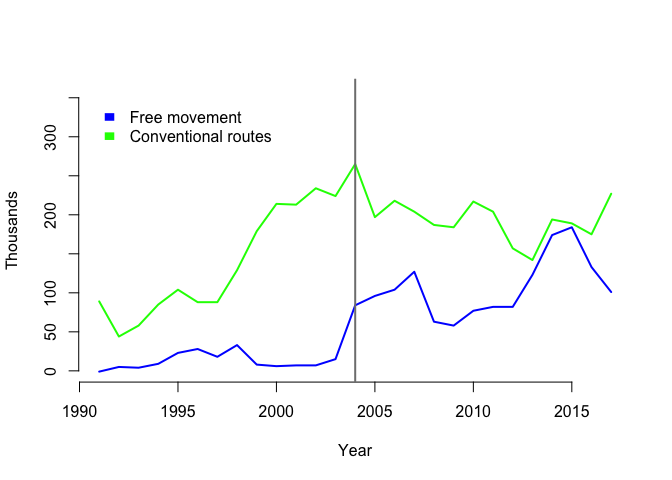

I'm interested in how migration from the EU and non-EU changed over
time, and the effect that free movement for EU nationals had on access
for non-EU migrants. Rather than go back to the start of free movement,
I focused on the effect the [expansion of the Union from
2004](https://eu.boell.org/en/2014/06/10/europe-after-eastern-enlargement-european-union-2004-2014).

The problem, of course, is estimating the number of non-EU migrants
there *would* have been without the expansion [1]. Recent [reports from
the Office of National Statistics
(ONS)](https://www.ons.gov.uk/peoplepopulationandcommunity/populationandmigration/internationalmigration/bulletins/migrationstatisticsquarterlyreport/may2019)
gave me an idea for a method of working it out. The numbers have shown
that as EU migration to the UK has fallen, non-EU migrants are taking up
the slack. Economists have concluded that [UK employers are willing to
make the extra effort to sponsor
migrants](https://www.newstatesman.com/politics/staggers/2019/05/when-it-comes-immigration-uk-already-post-brexit-era)
when fewer bureaucratic options are available.

Importantly, this implies that over the short term there is roughly a
total number of jobs or other social positions that can be filled by
migration each year [2]. Therefore, we can estimate the number of non-EU
migrants there would have been without expansion using the number of EU
migrants who came to the UK through freedom of movement.

The ONS data comes in multiple tables with lots of detail, but
fortunately the [Migration Observatory at Oxford
University](https://migrationobservatory.ox.ac.uk/resources/briefings/long-term-international-migration-flows-to-and-from-the-uk/)
have compiled the annual net migration data by EU/non-EU, which can be
downloaded as a [.csv file](net-migration-by-citizen.csv). The file
lists the net number (in thousands) of EU and non-EU migrants coming to
the UK between 1991 and 2017 [3]. The figures for EU migration from 2004
to 2007 are underestimated because of a problem with measurement. Before
2004, 'EU' refers to the pre-expanded EU (western Europe); migrants from
countries who joined the EU around 2004 are included in 'non-EU' before
2004, and 'EU' after. For the purpose of this analysis that makes sense:
the analysis is looking at disparities in access according to whether
using freedom of movement or conventional means, and not singling-out
migration from particular countries.

Having loaded the data into [R](https://www.r-project.org), a free
statistical software [4]. The raw data is presented in the simple graph
below. It shows EU and non-EU net migration from 1991 to 2017. We can
see the strong upward trend in non-EU migration from 1991 to 2004 (green
line), and subsequent leveling-off or slight decline. In contrast, the
blue EU line is relatively flat before 2004, after which it jumps up.

I did a couple of small calculations (in the code at the end) to get a
rough estimate of the number of non-EU migrants that there *would have
been* had the EU not expanded in 2004 (the 'missing' non-EU migrants). I
added the number of EU migrants to the number of non-EU migrants after
2004; the assumption here is that the jobs would have been filled by a
mix of EU and non-EU migrant, using the same logic applied to the recent
ONS figures. Since there was a constant level of net migration from the
EU before 2004, I subtracted the median migration between 1991 and 2003
from each year after 2003.

The number of non-EU migrants that would be expected had there not been
the expansion in 2004 is shown in red on the graph below. This shows the
'missing' non-EU migrants; as expected this tracks the EU and non-EU
migration.

The total missing non-EU migrants is the sum of the difference between
the red and green lines, which is 2,572,000. Since the Migration
Observatory [estimates that the non-EU foreign-born in the UK in 2017
was only about twixe that figure at
5,677,000](https://migrationobservatory.ox.ac.uk/resources/briefings/migrants-in-the-uk-an-overview/),
the 'missing' are 31% of the total non-EU nationals that would be living
in the UK without the expansion of access in 2004. Another way of
putting it, would be to say that the non-EU born population of the UK in
2017 would have been 45% higher than it was.

This is a crude analysis, and a very rough estimate of the
counterfactual effects on non-EU migration had free movement of people
not been expanded in 2004. There are of course assumoptions, such as
that the economy would have grown at the same rate, which could affect
the result. It's somewhat confusing having people from countries that
joined the EU in 2004 count in different groups depending on the year;
another analysis might break these down, but I am more interested in the
route of access than in which countries people are coming from.

    # Add EU migration after 2003
    m91_03 <- median(d[1:13,5]) # median migration before 2003
    d$nonEU.plus <- d$Non.EU + d$EU - m91_03
    d[1:14,6] <- d[1:14,4]

[1] This is known as the 'counterfactual', what happened counter to
fact, and estimating this is the main problem in causal analysis
because, by definition, it isn't observed.

[2] The total number of posts (jobs, relationships) can increase because
of the effects of migration on the economy, it's not that there's a
limit to the size the country/economy could become, however that takes
time. It's a dynamic process, but in the short-run it seems like a
plausible simplification to say there are a finite number of posts.

[3] 2018-2019 would be possible but require downloading the ONS data).

[4] All the code for this post is available [here](Graph.Rmd).

