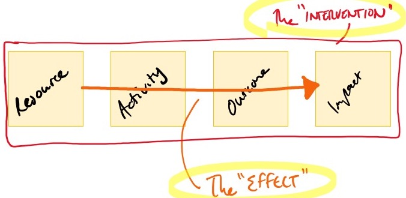
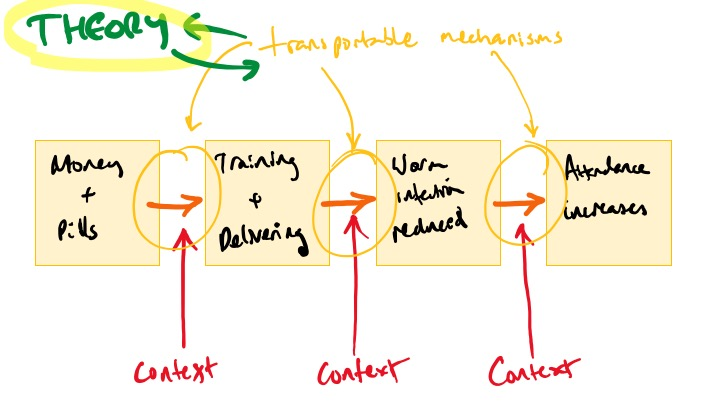
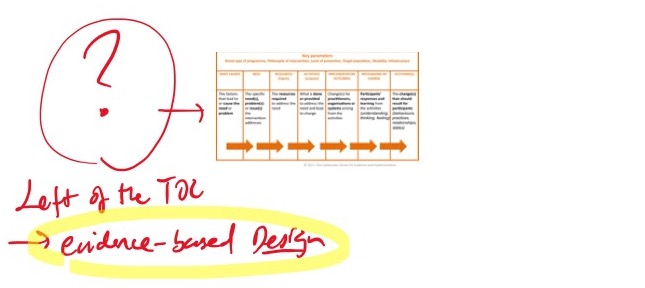
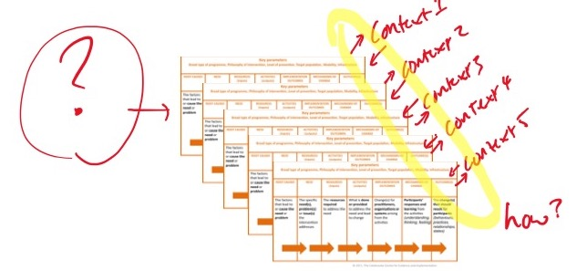

**Below is the text of a talk I gave at an Education Endowment Foundation event on Monday the 28th of October at the Wellcome Trust in London**

I'm going to be talking about how best to learn from evaluation to inform decisions and different settings. This presentation is informed by [piece of work](https://cedilprogramme.org/designing-evaluations-to-provide-evidence-to-inform-action-in-new-settings/) that I did with colleagues from a range of disciplines, for the centre of excellence for development impact and learning (CEDIL), which is funded by DFID. Some of these ideas are based on reviews of the literature and also from discussions among the authors who included economists and philosophers and psychologists epidemiologists and sociologists. I should say that any good ideas in this talk are probably attributed to one of my co-authors.

I’m going to focus on questions and a change in focus, and less on the actual methods for learning more, which we may pick up in the discussion afterwards. 

The first thing I think it's important to establish is what it is we are doing when we doing evaluation, and that what we hope to get is *not* what we can actually learn. 

Usually, what we evaluate is an intervention that has the form of something like this below, which is that it is a series of elements in logic model or theory of change that goes from a very high level in the form of some kind of resource, through a sequence of causal relations to some kind of change which we refer to as the impact. 

Consider an example of such intervention: deworming medication to improve school attendance. The logic model for this intervention could look something like this below. The theory of change says that if you have resources in the form of some money and medication this can then be used to train healthcare workers and to the delivery of the pills in the schools which should reduce worm infections in children and thus increase the school attendance. 

When doing evaluations we think of this whole theory of change as ‘the intervention’, the resources but also everything that we intend to happen in the activities in the immediate outcomes. The headline ‘effect’ is the association between the resources allocated and the change in the indicators that were most interested in (in this case and school attendance.). 

To use this information for elsewhere it would be nice to say this effect we've estimated is somehow *embodied* in the intervention itself.  However, with interventions like these, each of the steps in the causal chain depends on the context. 

In this example, to go from the resources in the form of money and pills to training and delivery of those pills will depend on the availability of good health care workers and also that the roads are open and the schools are willing to take part. To go from the delivery to reducing the infection will depend on having infections in the first place and also that they are not immediately reinfected by the local environment. And whether reducing worm infection increases school attendance will depend on whether the worm infections were so heavy that they were reducing school attendance before treatment, and also that those infected don’t have comorbidities which would also reduce School attendance such as disabilities. 

Given all of these steps and all of these requirements, it's clear that the money and the pills on the left are not somehow imbued with the effect of changing school attendance on their own. Instead, the effects that we might be tempted to ascribe to an intervention are entirely dependent on the contexts which will affect each step in this causal chain. 

In other words, the effect, whether positive or null, of deworming on school attendance is *not something that is part of, or inherent to, deworming medication*. It is meaningless to say that deworming medication 'works' to improve attendance, i.e. has the effect of improving attendance. Even if we observe it happening ten times we cannot say that it 'works', because the chain of cause-and-effect depends so heavily on the context. Similarly, if we found that it did not work in a number of evaluations, this would not mean that it 'does not work' in general. 

Despite knowing this, we often hear people talking about deworming medication having the capacity to increase school attendance without much consideration for some of these contextual factors. (We also hear people saying that it doesn't 'work'). 

Of course, if we had a school attending problem in Devon or in Whitechapel, delivering medication would not increase school attendance at all. 

Although this seems like an obvious and trivial example, the problem applies to most of the interventions that we evaluate: transporting the effects of the intervention isn't very meaningful without thinking about context.

So what can we draw from an evaluation that can be useful? 

What our discussions led to was the idea that on some level there are transportable mechanisms; things that we can understand about the world which will form the building blocks for these interventions.

Understanding mechanisms could mean more reliable design of interventions, because in most TOCs these mechanisms are the arrows between the objects. 

As an aside: some [others have done work for CEDL](https://cedilprogramme.org/representing-theories-of-change-technical-challenges-with-evaluation-consequences/) reflecting on the lack of specificity of the arrows, when these are the core elements for building theories behind our interventions. 

However, to make what we learn transportable they need to be part of building a body of knowledge linked with a broader scientific theory. 

This means breaking out of silos. 

So, while we would probably think of this evaluation as being about education, what might be useful in terms of learning would be to cut across each of these mechanisms by linking with the relevant theories relating to each of them, which might not be about education at all.
 
For example: we might learn something about how worm infection affects health, including the effect of comorbidities, that will be linked with a prior research on how different degrees of worm infection affect health. We should be speaking to people who know about worms, who perhaps have never thought about classrooms. Or we might learn something about how to recruit and train a cadre of healthcare workers to deliver an intervention in schools such that there is high take-up and low refusal to participate. In which case, we should be speaking to people in healthcare delivery, management, or implementation science. 

Better understanding of these steps will be informative when we next need to include such a step in the design of an Intervention. 

Testing hypotheses about mechanisms and building bodies of knowledge about these will generate solid building blocks from which we can build more confident interventions. 

The second approach that we think could be useful for learning more from evaluations also follows from the idea that effects depend on the context.
 
Effects of resources and actions depend on context and context. And context varies between places, people, and over time so the question is: how can we learn about how to best match action and context? 

There were two ideas to come out of this:

First: let's say we have a theory of change; this is our intervention; this is what we are evaluating.

The evaluation activities will focus in on the elements of this, including the steps between each column in the theory of change as I was just mentioning beforehand. 

However, given the importance of the context into which interventions delivered, we might wonder: why was this intervention designed and implemented here? what were the processes that went into picking this intervention and allocating this intervention to this part of the world? or this type of school? or these children?

We should be *looking to the left* of the theory of change. 

This means looking at some of the processes that go on amongst people in this room; thinking less of interventions as being something that we do but something that we are part of.

You can think of learning about methods of diagnosis is being a bit like this. When you go to your doctor the doctor spends a lot of time trying to work out what is wrong with you before they make any actual intervention. 

The doctor uses lots of different ways of doing this including tests asking your history and making direct observation. They learnt over time about which of these methods is most effective any which combination. 

I am sure we all do things that seem very sensible, like running focus groups, piloting interventions, and then choosing what should go forward. How many of those approaches designing have been well tested? What evidence do we have that they are good for matching interventions with contexts? Is is not telling that so many interventions don't work? 

Perhaps if we were to think more about the ways in which we come up with our interventions and the ways in which we target interventions then we might do better at finding interventions that ‘work’ in the future. 

The second idea about matching action and context it might be possible to build-in elements of adaptation and local context dependence which might increase the efficacy of what is delivered. 

But what is the optimal way of doing this?

An example of an approach that explicitly attempts to have a high degree of local adaptation comes from the women's groups interventions to reduce neonatal mortality.

The intervention brings women together in groups so they make locally informed decisions about how to improve their own health and the health of their newborn children. But what they actually do in one village  to the next will vary a lot. It will depend on what they think the problem is. 

A number of evaluations have shown they're able to drastically reduce neonatal mortality. This suggests that this kind of deliberative democracy and bringing people together to make informed decisions may be a good way of matching intervention with contexts. However, there may be situations where this might not be such a good way of doing it. More research would be needed to learn what are the mechanisms through which optimal context-responsive interventions can be delivered at scale. 

In summary: our review and interdisciplinary discussion suggested that to learn more from evaluations to inform future decisions in new contexts we should use evaluations to learn as much as possible about underlying mechanisms, how they work, linking that with broader theory, involving various disciplines, to create stronger building blocks to build better interventions in the future. And we should be thinking harder about how we match interventions with context, whether that's at higher-level decision-making, or how it can be built into the delivery of interventions so that they are more locally informed.

My final thought is that it isn't totally clear what form the knowledge about mechanisms and matching should take.

It is tempting to think that these should be described in papers reports maybe they should be written as manuals or come out of guidance from the EEF or the WHO. 

But perhaps the learning about mechanisms or about how to match action and context should take the form of relationships or institutions perhaps sharing this kind of knowledge is more about how we can start teams so that past experience is best used to inform future decision-making. 

For example, researchers at LSHTM have partnered researchers and practitioners in China in an area that has been very successful at reducing maternal and neonatal mortality with counterparts in Tanzania where outcomes have been less good. The aim of the project was to share the learning, and involved exchange visits and the formation of on-going relationships. There are plenty of examples of this kind of knowledge-exchange from the sociology of science, from the tech sector, and from medicine, where direct and social relationships are needed to transfer knowledge and methods from one place to another. 

We do need to think hard about what form this kind of knowledge could take so that even if we are able to produce useful and inform and potentially informative knowledge from the evaluations that we do that takes a form can actually inform future decisions and actions.
