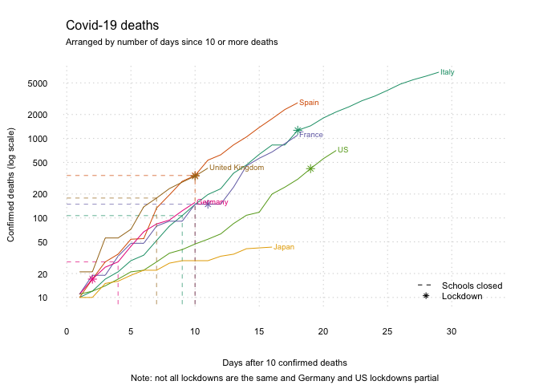

In previous walk-throughs we have [made graphs of the emerging Covid-19 deaths](https://calumdavey.github.io/Covid-Deaths/) and [added data on school closures](https://calumdavey.github.io/Covid-Deaths-schools/). 
In this short post we will add points to indicate when countries have entered 'lockdown'.
There is no universal definition of 'lockdown'.
Some countries have had partial lockdowns, e.g. in specific regions or cities only.
The severity of the 'lockdown' has also varied, with some countries more stringently controlling people's movement than others.
These dates, therefore, are only indicative.
As for previous posts, the purpose here is to help people interested in producing graphs from data to do so. 
Hopefully they can be improved and made more precise. 

Re-run the previous scripts to load the data.  

```r
# Run the previous .R script 
source('COVID_DEATHS_GRAPHS_SCHOOLS.R')
```

Load lock-down data, taken from various websites.

```r
ld <- read.csv('lockdown.csv',as.is = T)

ld$Date <- as.Date(ld$Date, "%d/%m/%Y")
```                     

Add the lock-down data to the graph by re-running the graphing code.
This is getting longer and more complicated now, but each step is simply adding a new element to the graph.

```r
# Start with an 'empty' plot of Italy 
plot_data <- data[data$Group.1=='Italy', ]

plot(plot_data$x, type = 'n', 
     log = 'y', # y-axis is on the log scale 
     bty = 'n', # no border around the plot 
     xlim = c(1,(nrow(plot_data)+4)),
     axes = FALSE, bg='gray80',
     xlab='Days after 10 confirmed deaths',
     ylab='Confirmed deaths (log scale)',
     sub='Note: not all lockdowns are the same and Germany and US lockdowns partial',
     cex.sub=.7,
     cex.lab=.7)

# Add gridlines 
grid(nx = NULL, ny = NULL, col = "lightgray", lty = "dotted", lwd = par("lwd"), equilogs = F)

# Add each of the other countries 
for (country in countries){
  plot_data <- data[data$Group.1 == country,]
  # Plot the lines 
  lines(c(1:nrow(plot_data)), plot_data$x, 
        col=cols[which(countries==country)])
  
  # Add the School closures
  # Skip countries where schools haven't closed 
  if (country %in% schools$Country){
    # Create marker for when schools first closed
    closed <- schools[schools$Country==country,]
    closed <- data.frame(date = as.Date(closed[1,1],
                                        '%d/%m/%Y'), now=1)
    
    # Merge the marker with the plot data 
    plot_data_s <- merge(plot_data, closed,
                         by.x='Group.2',
                         by.y='date',
                         all.x=T)
    
    # Identify day and deaths when schools closed
    closed <- c(which(plot_data_s$now==1),
                plot_data_s$x[which(plot_data_s$now==1)])
    
    # Add the lines 
    lines(x=c(closed[1],closed[1]),
          y=c(5, closed[2]),
          col=cols[which(countries==country)],
          lty=2, lwd=.7)
    lines(x=c(0,closed[1]),
          y=c(closed[2], closed[2]),
          col=cols[which(countries==country)],
          lty=2, lwd=.7)
  }
  
  # Skip countries without lockdown 
  if (country %in% ld$Country[!is.na(ld$Source)]){
    locked <- ld[ld$Country==country,]
    
    # Merge the marker with the plot data 
    plot_data_l <- merge(plot_data, locked,
                         by.x='Group.2',
                         by.y='Date',
                         all.x=T)
    
    # Identify day and deaths when locked
    locked <- c(which(!is.na(plot_data_l$Source)),
                plot_data_l$x[which(!is.na(plot_data_l$Source))])
    
    # Add the lockdown 
    points(x=locked[1],
           y=locked[2], 
           col = cols[which(countries==country)], pch=8)
  }
  # Add a label
  text(x=nrow(plot_data), y=max(plot_data$x, na.rm=T),
       label=paste0(country), #,' (',nrow(plot_data),' days)'), 
       pos=4, offset=.1, cex=.6, font=1,
       col=cols[which(countries==country)])
}

# Add the axes 
axis(1, lwd=0, cex.axis=.7)
axis(2, lwd=0, las=1, cex.axis=.7)

# Add titles
mytitle = "Covid-19 deaths"
mysubtitle = "Arranged by number of days since 10 or more deaths"
mtext(side=3, line=2, at=-0.07, adj=0, cex=1, mytitle)
mtext(side=3, line=1, at=-0.07, adj=0, cex=0.7, mysubtitle)

# Add a legend 
legend(x='bottomright', 
       legend=c('Schools closed',
                'Lockdown'), lty=c(2,NA), pch=c(NA,8),
       bty='n', cex=.7)
```



